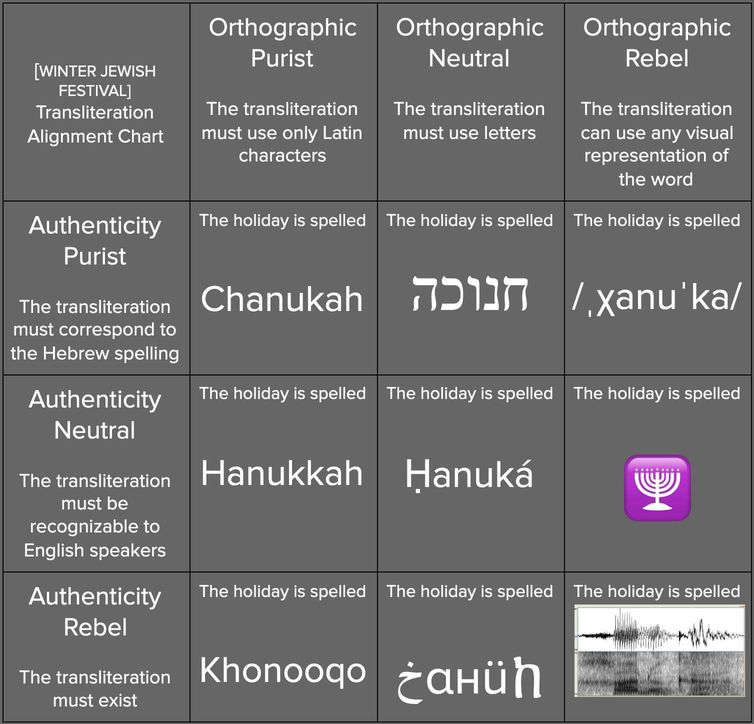

## What Transliteration Is and Is Not

Translators wrestle with the nuances of their languages.
Words can have semantic domains that do not neatly map to words in the language into which they are translating.
Choices are made at every level to capture the author's meaning while simultaneously ensuring that the translation is intellegible.

Unlike translation where one translates from one _language_ into another _language_, transliteration is an entirely different process that involves going from one _script_ into another _script_. People may speak of transliterating Hebrew into English, but the language actually remains the same.

As the image above illustrates, the word does not change (it is still a Hebrew word), but the representation of the word changes, either by using Latin characters, [IPA characters](https://en.wikipedia.org/wiki/International_Phonetic_Alphabet) or even sound waves.
The representation in Latin characters can vary widely as well; the bottom left box pushes this representation to the extreme.

Going from one script to another is a more mechanical process which can give the false impression that no nuance is involved.
A שׁ makes the /sh/[^1] sound, what's so difficult about that?

[^1]: This sound is technically called a [voiceless palato-alveolar fricative](https://en.wikipedia.org/wiki/Voiceless_postalveolar_fricative#Voiceless_palato-alveolar_fricative) and is written with the IPA symbol [ʃ]. For simplicity, I will use /sh/.

To make a good transliteration 3 factors must be taken into consideration:

1. The goal of the transliteration
2. The audience's target language _&_ script
3. The source language _&_ script

## The Goal

### Audience

The first consideration for transliteration is the audience.
For those in Hebraic studies, _šālôm_ may be a perfectly reasonable transliteration, but to the average person, it is alphabet soup.

### Intent

The second consideration, closely linked to the first, is the intent.
What is this transliteration attempting to do?

If the intent is to simply avoid having right-to-left text, then any transliteration can do.

If the intent is to highlight a relationship between words that would otherwise be obscured by their respective scripts, then a more technical transliteration may be in order. The Arabic word سلام _salām_ and Hebrew word שׁלום _šālôm_ are related, but their respective scripts obscure that relation. By using transliteration, the relationship is made clear.

If the intent is to make the text readable and easily pronounced, then a transliteration that conforms to rules recognizable to the reader is better (e.g. _shalom_).

Most of Ta'atik's modules are aimed at making Hebrew text readable for those who do not read the Hebrew script.

## The Audience's Target Language _&_ Script

Any language can be written in any script.
My name written in Hebrew characters — צ׳ארלס — is still an English name.
The Mishnah recognizes that even the Hebrew script we know today is originally an Aramaic script ([Megillah 1:8b.19](https://www.sefaria.org/Megillah.8b.19?lang=bi)).

The target language is understood as the orthography and script of a particular audience's language.
Readers of English readily recognize "sh" as the /sh/ sound, whereas German readers more readily understand "sch" as the /sh/ sound.
Even though English and German share the majority of the same letters from the Latin script, the orthographies employed follow their own rules. For this reason, we can talk about transliterating into English, though we mean the orthography and script common to the English language.

Ta'atik modules use the scripts common to the audience's target language so as to produce transliterations that are easily accessible. Some of the target languages include German, Greek, and Hungarian.

## The Source Language _&_ Script

At first glance, the source language may seem simple — it's Hebrew.
Though the script may be used to write Hebrew, we have to ask which Hebrew.

To exemplify this, let's consider the example of שַׁבָּת and all the various pronunciations it has in the different Hebrew reading traditions.

### The _Shin_

The _shin_ is realized as /sh/ in the overwhelming majority of reading traditions.

### The _Patach_

The _patach_ is realized typically as the sound /a/ (like the "a" in 'psalm') in most reading traditions as well.

### The _Bet_

Things now become more interesting with the _bet_.
The _bet_ has two variations — with a _dagesh_, like in the word above or without.
The _dagesh_ affects the pronunciation of the _bet_; with the _dagesh_ it is realized as /b/, but without the _dagesh_ it is realized as /v/.

The _dagesh_ affects the _bet_ in another way. In most Ashkenazic and Sephardic pronunciations (and Modern Hebrew which is based off of Sephardic), this is the only way the _dagesh_ affects the _bet_.
In other traditions such as Yemenite and Tiberian, the _dagesh_ also indicates, _gemination_ a feature where a consonant is held for an extended amount of time.
In Latin characters, this is often represented by doubling the letters — "bb."

It is still common to see "bb" in transliterations into English because of the written history of _sabbath_ in English.

### The _Qamets_

At first, transliterating the _qamets_ may appear simple — "a."
But the _patach_ is already represented by "a"!
If one character is already represented by "a", should we use "a" for a completey different character?

In Sephardic and Modern Hebrew, the sound of the _patach_ and _qamets_ are indistinguishable (except for the _qamets qatan_, but that's for another day).
In Tiberian (the tradition of those who created the _niqqud_) and Yemenite, _patach_ and _qamets_ were separate sounds and thus represented by different characters. In these traditions, the _qamets_ is similar to the vowel sound in the word "thought," and is represented by this [ɔ] [IPA symbol](https://en.wikipedia.org/wiki/Open-mid_back_rounded_vowel).
In Ashkenazic pronunciations, the sound of _qamets_ can fluctuate between the /a/ sound and the /o/ sound.

### The _Tav_

The final letter is _tav_, which like the _bet_ has variants with or without a _dagesh_.
In almost all communities a _tav_ with a _dagesh_ is realized as /t/ though there are some minor exceptions.
Without a _dagesh_, the pronunciation varies more widely.
In Sephardic pronunciations, it is realized as /t/ just like with a _dagesh_.
In Yemenite and Tiberian, it has a /th/ sound.
In Ashkenazic pronunciations, it is realized as /s/.

### Putting It All Together

We can see that even a common word can be transliterated in several ways:

| Tradition  |    Transliteration    |
| :--------: | :-------------------: |
| Sephardic  |       _shabbat_       |
|  Yemenite  |       _shabbɔt_       |
|  Tiberian  |      _shabbɔth_       |
| Ashkenazic | _shabbas_ / _shabbos_ |

There are other reading traditions that have not been considered here such as the ancient Babylonian tradition and the Romaniote tradition.

## Conclusion

In order to create a quality transliteration attention must be given to the three factors above.
The greatest difficulty lies not always in following these guidelines but recognizing our own assumptions about them.

An ill defined goal can lead to inconsistent transliterations.
The constraints of the audience's target language and orthography can make it difficult to properly render Hebrew.
Additionally, the target audience may already have common conventions for some words, as is the case with English where _sabbath_ already has a well established written history.
Lastly, transliterations must be aware of which Hebrew they are using as a source language.
Modern Hebrew has become the _de facto_ standard in many cases, but every community may not desire that.
When that is the case, custom tools need to be developed.
